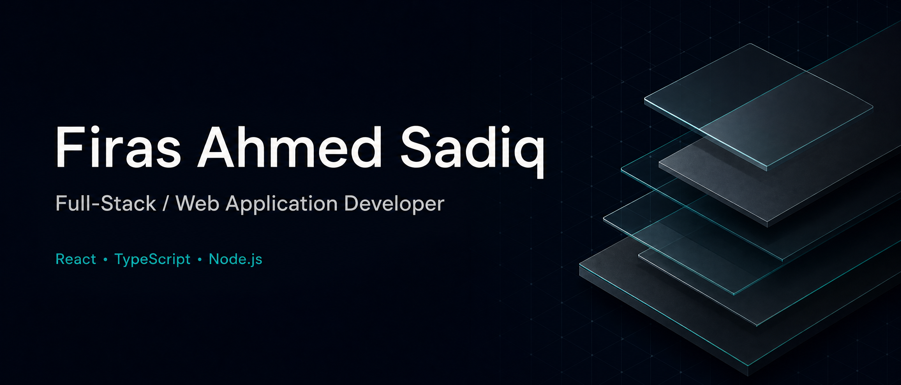

# Firas Ahmed Sadiq

### Full-Stack / Web Application Developer

**React · TypeScript · Node.js**  
Baghdad, Iraq · Open to software development opportunities and relocation to Germany

[Email](mailto:firasalsamaraai@gmail.com) · [LinkedIn](https://linkedin.com/in/firas-alsamaraai-255051257)

---

## About me

I'm a freelance full-stack developer with **4+ years of experience** delivering and maintaining web applications, REST APIs, administrative dashboards, and business-management systems.

My work connects business requirements with practical software: database schemas, backend services, responsive interfaces, and the access controls that support day-to-day operations. I work across the delivery lifecycle, from requirements and implementation to testing, deployment, maintenance, and support.

**Primary focus:** full-stack web development, business applications, and security-conscious implementation.

## Selected project experience

### 01 / Contracting Company Management System

A centralized application for managing **projects, contracts, expenses, employees, and business operations**.

- Translated contracting workflows into an application that brings related operational records together.
- Focus: business-process modeling, administrative interfaces, and structured data management.

### 02 / International Freight Transportation Platform

A business platform covering **shipments, transport stages, payments, balances, expenses, and revenue**.

- Developed workflows connecting transport activity with the financial records associated with it.
- Focus: multi-stage workflows, operational tracking, and financial data organization.

### 03 / Mobile-Phone Retail Management System

A retail application for **products, inventory, sales, customers, and stock movements**.

- Created a controlled interface for managing retail records and inventory activity.
- Focus: inventory workflows, sales operations, and application access controls.

> Project source repositories are currently private. These summaries describe experience listed in my CV; they do not link to public source code or live demos.

## Technical toolkit

| Area | Technologies & practices |
| --- | --- |
| Frontend | React.js, Next.js, TypeScript, JavaScript, HTML5, CSS3, Tailwind CSS, Bootstrap |
| Backend | Node.js, Express.js, Laravel, PHP, Python, REST APIs |
| Data | PostgreSQL, MySQL, SQLite, MongoDB, database design, data validation |
| Delivery | Git, GitHub, Docker, Linux, testing, debugging, deployment |
| Application security | Authentication, authorization, RBAC, password and session security, OWASP Top 10, dependency review |

## How I work

- **Understand the workflow:** turn requirements into specifications, data models, and application behavior.
- **Build end to end:** connect responsive interfaces with backend services and databases.
- **Implement access controls:** apply authentication, authorization, input validation, and secure error handling.
- **Test and maintain:** perform functional and authorized security testing, troubleshoot issues, and support deployed applications.

## Background

**Freelance Full-Stack Web Developer — Application Security Focus**  
Self-employed · January 2022–present · Baghdad, Iraq

Client sectors include contracting, international freight, retail, skincare, and pharmaceuticals.

**Bachelor's Degree in Telecommunications Engineering**  
Huazhong University of Science and Technology (HUST), China · 2018–2022

**Languages:** Arabic — Native · English — Advanced · Chinese — Beginner · German — Basic

## Let's connect

I'm interested in opportunities involving **full-stack web applications, REST APIs, and business-management systems**.

[Email me](mailto:firasalsamaraai@gmail.com) · [Connect on LinkedIn](https://linkedin.com/in/firas-alsamaraai-255051257)
